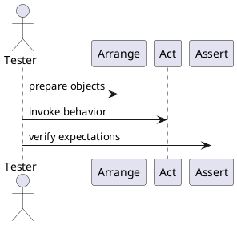
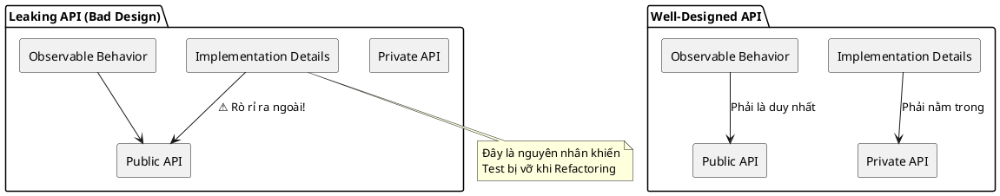
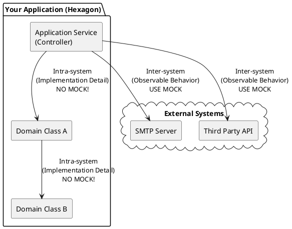
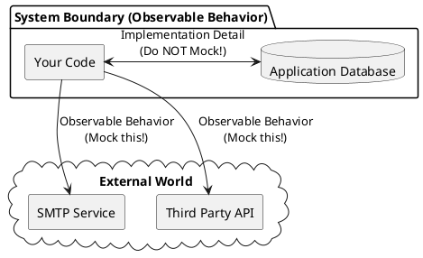

# Tóm tắt chính (đã tổng hợp)

- Unit testing là một mạng lưới an toàn (safety net) giúp phát hiện regressions và duy trì tốc độ phát triển về dài hạn.
- Nếu code khó để unit-test thì thường là dấu hiệu thiết kế kém (tight coupling). Ngược lại, dễ test không đảm bảo code hoàn hảo.
- Mục tiêu chính khi viết test: phát hiện regressions, giảm chi phí bảo trì, và cho phép refactor an toàn.
- Không có tests: dự án phát triển nhanh lúc đầu nhưng sau đó chậm lại do entropy (mã trở nên phức tạp và dễ hỏng). Có tests: yên tâm sửa đổi và tái cấu trúc.
- Viết tests cần đầu tư ban đầu nhưng đem lại lợi ích dài hạn.
- Một số khái niệm cần nhớ: regression (lỗi tái xuất), sustainability (khả năng duy trì mã), coverage (line/branch) — coverage là chỉ báo, không phải thước đo chất lượng tuyệt đối.

## ✅ Tóm tắt: Test tốt vs Test tồi (ngắn)

- Test tốt: nhanh, rõ ràng, độc lập, ít chi phí bảo trì, tập trung vào hành vi quan trọng.
- Test tồi: chậm, dễ vỡ, nhiều boilerplate, tạo báo động giả hoặc redundant.

## Chuyển tiếp
Tiếp theo file sẽ trình bày chi tiết về AAA, coverage, các mẫu dữ liệu test và ví dụ Python (phần dưới). 
# Unit testing — Bài học tổng hợp (sắp xếp lại)

Phiên bản này sắp xếp và bổ sung ví dụ Python + minh họa PlantUML để file trở thành một bài học tự học về unit tests, integration tests, coverage, và các mẫu dữ liệu test.

## Tóm tắt ngắn gọn

- Unit testing là một công cụ bảo vệ (safety net) để giảm regressions và duy trì tốc độ phát triển dài hạn.
- Nếu code khó test: đó thường là dấu hiệu thiết kế kém (tight coupling). Nhưng dễ test không có nghĩa là code hoàn hảo.

## Mục tiêu khi viết test

- Phát hiện regressions.
- Dễ bảo trì, nhanh và rõ ràng.
- Cô lập hành vi cần kiểm tra (unit of behavior), không test mọi thứ cùng lúc.

## Tiêu chí: Test tốt vs Test tồi

- Test tốt: nhanh, rõ ràng, độc lập, ít chi phí bảo trì, tập trung vào hành vi có giá trị.
- Test tồi: chậm, dễ vỡ, nhiều boilerplate, gây báo động giả, hoặc redundant.

## Phân loại tests (quick)

- Unit test: in-memory, nhanh, cô lập (Classical view) hoặc có mocks (London view).
- Integration test: kiểm tra tương tác giữa 2+ thành phần hoặc với DB/FS.
- End-to-end (E2E): kiểm tra từ đầu đến cuối hệ thống (user perspective).

## Test pyramid (PlantUML)

```plantuml
@startuml
skinparam handwritten true
package "Tests" {
  rectangle "Unit Tests\n(fast, many)" #palegreen
  rectangle "Integration Tests\n(slower, fewer)" #lightyellow
  rectangle "E2E Tests\n(expensive, few)" #lightpink
}
Unit Tests -down-> Integration Tests
Integration Tests -down-> E2E Tests
@enduml
```

## AAA pattern — Arrange / Act / Assert (vỏn vẹn)

- Arrange: chuẩn bị dữ liệu và SUT.
- Act: gọi phương thức/hành vi cần kiểm tra.
- Assert: kiểm tra kết quả (dùng assert rõ ràng — test là tài liệu).

PlantUML sequence (AAA):



## Coverage metrics — hiểu cho đúng

- Line coverage: % dòng code được chạy.
- Branch coverage: % nhánh quyết định (if/else) được thực thi.
- Coverage là chỉ báo (indicator):
  - Thấp => xấu (thiếu tests).
  - Cao => không đảm bảo test tốt (có thể thiếu assertion, chỉ execute mà không verify).

### Công thức branch coverage

Branch coverage = (branches traversed by tests) / (total branches)

Không chase số — viết test có ý nghĩa.

## Hai trường phái test: London (Mockist) vs Classical (Detroit)

- London: mock mọi dependency, kiểm tra interaction.
- Classical: chạy các class thật trong bộ nhớ, tập trung vào behavior.
- Chọn một phong cách cho team và tuân thủ để tránh tranh cãi.

## Khi 1 test trở thành Integration Test

- Shared dependencies (DB, file) => cần cleanup, chạy tuần tự.
- Out-of-process (HTTP, external services) => chậm, flaky.
- Kiểm tra nhiều units of behavior trong 1 test => mất tính định vị lỗi.

## Mẹo xử lý Arrange quá dài

- Extract helper functions/private builders.
- Object Mother: các factory static tạo mẫu phổ biến.
- Test Data Builder: fluent builder cho dữ liệu test (linh hoạt).

## Ví dụ Python: domain nhỏ (Customer, Order, Item)

Tập tin minh họa (3 lớp + tests). Dùng pytest.

```python
# models.py
class Item:
    def __init__(self, name: str, price: float):
        self.name = name
        self.price = price

class Customer:
    def __init__(self, first_name: str, is_vip: bool = False):
        self.first_name = first_name
        self.is_vip = is_vip

class Order:
    def __init__(self, customer: Customer):
        self.customer = customer
        self.items = []

    def add_item(self, item: Item):
        self.items.append(item)

    @property
    def total(self) -> float:
        return sum(i.price for i in self.items)

    def apply_discount(self):
        if self.customer.is_vip:
            # VIP: 10% off
            total = self.total
            return round(total * 0.9, 2)
        return round(self.total, 2)
```

```python
# test_standard.py  (Arrange 'phình')
from models import Item, Customer, Order

def test_order_total_with_discount_standard():
    # ARRANGE (nhiều chi tiết rõ rệt)
    customer = Customer(first_name="Hoang", is_vip=True)
    order = Order(customer)
    order.add_item(Item("Laptop", 1000))
    order.add_item(Item("Mouse", 50))

    # ACT
    discounted = order.apply_discount()

    # ASSERT
    assert discounted == 945.0
```

```python
# test_object_mother.py
from models import Item, Order

class CustomerMother:
    @staticmethod
    def vip():
        from models import Customer
        return Customer(first_name="VIP", is_vip=True)

def test_order_total_with_object_mother():
    customer = CustomerMother.vip()
    order = Order(customer)
    order.add_item(Item("Laptop", 1000))
    discounted = order.apply_discount()
    assert discounted == 900.0
```

```python
# test_builder.py
from models import Item, Order

class CustomerBuilder:
    def __init__(self):
        self.first_name = "Default"
        self.is_vip = False

    def with_vip(self, v: bool):
        self.is_vip = v
        return self

    def with_name(self, name: str):
        self.first_name = name
        return self

    def build(self):
        from models import Customer
        return Customer(first_name=self.first_name, is_vip=self.is_vip)

def test_order_with_builder():
    customer = CustomerBuilder().with_vip(True).with_name("An").build()
    order = Order(customer)
    order.add_item(Item("Pen", 10))
    assert order.apply_discount() == 9.0
```

Gợi ý chạy: cài pytest, đặt 3 file trên cùng thư mục, chạy `pytest -q`.

## Test design: practical guidance

- Ưu tiên test logic cốt lõi (billing, auth, permissions).
- Tránh test getters/setters tầm thường.
- Viết test như documentation: tên test mô tả hành vi bằng ngôn ngữ nghiệp vụ.
- Khi dùng parameterized/theory, đảm bảo mỗi case rõ ràng — nếu không, tách thành tests riêng.

## Kết luận ngắn

- Tests là khoản đầu tư: tốn thời gian ban đầu nhưng giảm chi phí về lâu dài.
- Coverage là công cụ chứ không phải mục tiêu. Viết assert có ý nghĩa hơn việc đạt %.
- Sắp xếp Arrange bằng builders/mothers sẽ giữ tests sạch và dễ đọc.

---

## Files minh họa (gợi ý)

- `models.py` — domain nhỏ (Item, Customer, Order).
- `test_standard.py`, `test_object_mother.py`, `test_builder.py` — ví dụ pytest.

Nếu bạn muốn, mình có thể: thêm code thực thi sẵn (với __main__), hoặc tạo một mẫu repository nhỏ kèm requirements.txt và README.

---

## Làm sao để biết một bài test là đáng giá (High Value)

- Cung cấp giá trị tối đa với chi phí bảo trì tối thiểu

### Bốn trụ cột của một bài Unit Test tốt (The Four Pillars)

  1. Protection against regressions (Bảo vệ khỏi sự thoái hóa): Bài test có phát hiện được lỗi khi bạn sửa code cũ hoặc thêm tính năng mới không?

  2. Resistance to refactoring (Khả năng chống lại sự gãy đổ khi tái cấu trúc): Khi bạn thay đổi cấu trúc code bên trong nhưng kết quả đầu ra không đổi, bài test có bị "đỏ" oan không? (Đây là trụ cột quan trọng nhất để tránh phí bảo trì).

  3. Fast feedback (Phản hồi nhanh): Test chạy càng nhanh, bạn càng chạy nó thường xuyên.

  4. Maintainability (Khả năng bảo trì): Code test có dễ đọc không? Có dễ thiết lập môi trường (setup) không?

#### Protection against regressions.

Regression (Sự thoái hóa) là gì?
Tác giả nhắc lại một định nghĩa thực tế: Regression là khi một tính năng đang chạy bình thường bỗng dưng bị hỏng sau khi bạn sửa code ở một chỗ khác hoặc thêm tính năng mới.

Triết lý quan trọng: Code không phải là tài sản (asset), nó là một khoản nợ (liability). Code càng nhiều, rủi ro tiềm ẩn bug càng lớn. Nếu không có "tấm khiên" bảo vệ, bạn sẽ bị nhấn chìm bởi việc đi sửa những lỗi cũ thay vì phát triển cái mới.

2. Thước đo khả năng bảo vệ (Metric)
Làm sao để biết một bài test có khả năng bảo vệ tốt? Bạn hãy nhìn vào 3 yếu tố:

Lượng code được thực thi: Bài test chạy qua càng nhiều dòng code thì khả năng nó phát hiện ra lỗi càng cao.

Độ phức tạp của code: Test một hàm xử lý thuật toán phức tạp sẽ có giá trị cao hơn nhiều so với test một hàm đơn giản.

Tầm quan trọng về nghiệp vụ (Domain Significance): Code xử lý logic cốt lõi (như tính tiền, kiểm tra quyền) quan trọng hơn code phụ trợ (boilerplate).

3. Đừng test những thứ tầm thường (Trivial Code)
Tác giả đưa ra một lời khuyên cực kỳ thực tế: Đừng tốn thời gian test những hàm getter/setter hay những thuộc tính đơn giản.

Lý do: Những đoạn code này quá ngắn và đơn giản, khả năng xảy ra bug ở đây gần như bằng không. Test chúng chỉ làm tăng số lượng bài test mà không mang lại giá trị bảo vệ thực tế.

4. Bao quát cả code "không phải của mình"
Đây là một ý rất hay: Bài test tốt nên bao hàm cả sự tương tác với các thư viện (libraries) và framework bên ngoài.

Lý do: Phần mềm của bạn chạy dựa trên các giả định về thư viện đó. Nếu thư viện cập nhật và thay đổi cách hoạt động, bài test của bạn phải phát hiện ra điều đó để đảm bảo phần mềm vẫn chạy đúng.

#### Resistance to refactoring

1. Refactoring vs. Observable Behavior
Tái cấu trúc (Refactoring) là thay đổi cấu trúc code bên trong (cho sạch hơn, nhanh hơn) nhưng không làm thay đổi hành vi có thể quan sát được (Observable Behavior).

Nếu bạn refactor mà test lại bị hỏng (chuyển sang màu đỏ), bài test đó đã tạo ra một False Positive (Dương tính giả).

2. False Positive: "Cậu bé chăn cừu" và sự nguy hiểm
Một bài test "mong manh" (brittle) là bài test gãy ngay cả khi logic ứng dụng vẫn đúng. Tác giả nhấn mạnh hậu quả tàn khốc của False Positive qua hai giai đoạn:

Mất cảnh giác: Khi bài test báo lỗi giả quá nhiều, bạn sẽ quen với việc "nó đỏ là do mình vừa sửa code ấy mà, không phải do bug đâu". Bạn sẽ bắt đầu phớt lờ hoặc tắt test (disable).

Mất niềm tin: Bạn không còn coi bộ test là "lưới an toàn" nữa. Khi không tin vào test, bạn sẽ ngại thay đổi code cũ, dẫn đến việc code base bị xuống cấp và tích tụ "mã độc" (legacy code) mà không ai dám đụng vào.

3. Tại sao False Positive lại xảy ra?
Nguyên nhân chủ yếu là do bài test bị gắn chặt vào chi tiết triển khai (Implementation Details) thay vì tập trung vào kết quả cuối cùng (Behavior).

Ví dụ với dự án LCD của bạn:

Gắn chặt vào triển khai (Tệ): Test kiểm tra xem hàm paintEvent có gọi lệnh painter.fillRect() đúng 128 lần không. Nếu bạn tối ưu code để vẽ nhanh hơn bằng cách gọi ít lệnh hơn nhưng hình ảnh vẫn thế, bài test sẽ báo lỗi giả.

Tập trung vào hành vi (Tốt): Test kiểm tra xem sau khi gọi lệnh, mảng display_memory có chứa đúng mã bitmap của ký tự đó không. Dù bạn đổi cách vẽ bên trong thế nào, miễn là dữ liệu đúng, test vẫn xanh.

. Nguyên nhân gây ra False Positives
False Positives xảy ra khi bài test kiểm tra "Làm thế nào" (How) thay vì "Cái gì" (What).

Sai lầm: Test soi mói các bước trung gian, cấu trúc nội bộ hoặc thuật toán của SUT.

Hậu quả: Khi bạn tối ưu thuật toán hoặc thay đổi cấu trúc lớp (Refactor) nhưng kết quả cuối cùng vẫn đúng, bài test vẫn "đỏ rực" vì các bước trung gian đã thay đổi.

2. Ví dụ về MessageRenderer: Bài học về tính mong manh
Tác giả đưa ra ví dụ về một class MessageRenderer dùng 3 sub-renderers (Header, Body, Footer).

Cách test TỆ (Listing 4.2): Kiểm tra xem MessageRenderer có đúng 3 sub-renderers không và chúng có đúng kiểu dữ liệu không.

Tại sao tệ? Nếu bạn quyết định không dùng sub-renderers nữa mà viết code gộp vào một hàm cho nhanh, hoặc đổi tên BodyRenderer thành ContentRenderer, bài test sẽ hỏng dù mã HTML tạo ra vẫn hoàn hảo.

Cách test "THẢM HỌA" (Listing 4.3): Đọc trực tiếp file code .cs và so sánh từng ký tự.

Tại sao thảm họa? Chỉ cần bạn thêm một dấu cách, một dòng trống hoặc đổi tên biến, test sẽ fail. Đây là đỉnh cao của sự vô dụng trong testing.

3. Giải pháp: Đứng dưới góc độ người dùng (End User's Point of View)
Để bài test bền bỉ với thời gian (Resistant to refactoring), bạn phải coi SUT là một Hộp đen (Black box).

Chỉ quan tâm: Đầu vào (Input) và Kết quả có ý nghĩa (Observable Output).

Ví dụ đúng: Truyền một đối tượng Message vào và kiểm tra xem chuỗi HTML trả về có chứa đúng các thẻ <b>...</b> và nội dung mong muốn hay không.

Kết quả: Dù bạn có dùng 10 sub-renderers hay viết 1 hàm duy nhất, dù bạn dùng vòng lặp hay dùng LINQ, bài test vẫn sẽ "Xanh" miễn là HTML đúng.

--- 

Chào bạn, đoạn văn này là "phần kết nối" cực kỳ quan trọng giúp bạn hiểu tại sao chúng ta cần cân bằng giữa việc tìm ra lỗi (Trụ cột 1) và tránh báo động giả (Trụ cột 2).

Mình sẽ giải thích bằng ngôn ngữ thống kê đơn giản và minh họa bằng code Python trên dự án LCD của bạn để bạn thấy rõ **False Positive** và **False Negative** nguy hiểm thế nào.

---

## 1. Bản chất của độ chính xác (Test Accuracy)

Tác giả đưa ra một công thức rất hay:


Để bộ test của bạn "có giá trị", bạn cần **tối đa hóa Signal** (tìm ra mọi bug) và **tối thiểu hóa Noise** (đừng kêu la khi không có lỗi).

Hãy nhìn vào bảng phân loại "sự thật" dưới đây:

|  | Code thực sự có Bug (Lỗi) | Code chạy Ngon (Đúng) |
| --- | --- | --- |
| **Test báo FAIL (Đỏ)** | **True Positive** (Quá tốt! Test đã bắt được lỗi) | **False Positive** (Báo động giả - Code ngon mà test lại kêu) |
| **Test báo PASS (Xanh)** | **False Negative** (Sót lỗi - Nguy hiểm ngầm) | **True Negative** (Mọi thứ đều ổn) |

* **Trụ cột 1 (Protection against regressions):** Giúp tiêu diệt **False Negative**.
* **Trụ cột 2 (Resistance to refactoring):** Giúp tiêu diệt **False Positive**.

---

## 2. Minh họa bằng Code Python (Dự án LCD)

Hãy xem 3 phiên bản test cho cùng một tính năng: **"Viết ký tự 'A' lên màn hình"**.

### Trường hợp 1: False Negative (Test "lọt lưới" - Độ bảo vệ kém)

Đây là trường hợp bạn viết test hời hợt. Code hỏng nhưng test vẫn xanh.

```python
def test_write_char_weak():
    lcd = SimulatedLCD16x2()
    
    # Act: Cố gắng viết chữ 'A'
    # Giả sử hàm write_char() bị bug, không làm gì cả
    lcd.write_char(0, 0, 'A') 
    
    # Assert: Chỉ kiểm tra xem hàm có ném ra lỗi (crash) hay không
    # KHÔNG kiểm tra xem 'A' có thực sự hiện lên không
    assert True 

```

> **Hậu quả:** Bạn deploy code ra production, khách hàng bật lên thấy màn hình trắng trơn, trong khi đó trên máy bạn test vẫn báo "PASS".

### Trường hợp 2: False Positive (Test "mong manh" - Báo động giả)

Đây là trường hợp test soi mói vào chi tiết triển khai (Implementation Details).

```python
def test_write_char_brittle():
    lcd = SimulatedLCD16x2()
    lcd.write_char(0, 0, 'A')
    
    # Assert: Kiểm tra biến nội bộ _internal_buffer (SAI LẦM!)
    # Giả sử hôm nay bạn dùng List để lưu bộ nhớ
    assert lcd._internal_buffer[0][0] == 'A' 

```

> **Hậu quả:** Ngày mai, bạn Refactor code, đổi `_internal_buffer` từ `List` sang `Dictionary` để tối ưu tốc độ. Code chạy vẫn đúng (màn hình vẫn hiện chữ A), nhưng bài test trên sẽ **FAIL** ngay lập tức vì không tìm thấy index `[0][0]`. Đây là báo động giả.

### Trường hợp 3: Test chuẩn (High Accuracy)

Cân bằng cả hai: Bắt được lỗi thật và lờ đi báo động giả.

```python
def test_write_char_accurate():
    lcd = SimulatedLCD16x2()
    lcd.write_char(0, 0, 'A')
    
    # Assert: Kiểm tra hành vi quan sát được (Observable Behavior)
    # Hàm get_pixel là cổng giao tiếp công khai, đại diện cho những gì mắt người thấy
    pixel_state = lcd.get_pixel_at(row=0, col=0, pixel_x=2, pixel_y=2)
    
    # Chữ 'A' thì pixel giữa phải sáng
    assert pixel_state == COLOR_ON 

```

---

## 3. Động lực học theo thời gian (Dynamics over time)

Tác giả đưa ra một biểu đồ thời gian rất quan trọng về sự nguy hiểm của False Positive.

### Giai đoạn đầu (Project mới khởi động):

* **Ưu tiên:** Tìm bug (Trụ cột 1).
* **False Positive:** Không đáng sợ lắm. Code còn ít, còn mới, nếu test báo lỗi giả do refactor, bạn sửa lại test cũng nhanh.

### Giai đoạn sau (Project đã lớn/Product maintain):

* **Vấn đề:** Code bắt đầu "thối" (rot), lộn xộn. Bạn CẦN phải Refactor để dọn dẹp.
* **Nguy cơ:** Lúc này **Resistance to refactoring** (Trụ cột 2) trở nên sống còn.
* Nếu test báo lỗi giả quá nhiều  Dev sợ không dám sửa code cũ nữa  Code ngày càng tệ hại  Dự án chết dần.
* Nếu Dev lờ đi các cảnh báo đỏ (vì nghĩ là báo giả)  Bug thật lọt vào production.


---

## 4. Bài học áp dụng cho bạn

Bạn đang viết Simulator LCD bằng Python/Qt.

1. **Đừng test biến `private`:** (Ví dụ: `self.display_memory`). Hãy test qua các hàm `public` (Ví dụ: `lcd.get_text()` hoặc logic vẽ pixel).
2. **Chuẩn bị cho tương lai:** Bây giờ code còn ít, bạn thấy test kiểu gì cũng được. Nhưng hãy tưởng tượng 6 tháng nữa, bạn muốn thay đổi cơ chế render từ `QPainter` sang `OpenGL` cho mượt.
* Nếu bạn viết test phụ thuộc vào `QPainter`, bạn sẽ phải vứt bỏ toàn bộ test cũ (False Positives).
* Nếu bạn viết test dựa trên đầu ra Pixel/State, bạn có thể thay đổi engine bên dưới thoải mái mà test vẫn Xanh.


**Bạn có muốn xem tiếp về Trụ cột thứ 3 và 4 (Fast Feedback & Maintainability) không? Hai cái này sẽ dễ thở hơn hai cái đầu đấy!**

---

Chào bạn, chúng ta đang đi đến mảnh ghép cuối cùng của bộ khung đánh giá chất lượng Unit Test. Nếu hai trụ cột đầu tiên (Regression Protection & Resistance to Refactoring) tập trung vào độ **CHÍNH XÁC**, thì hai trụ cột cuối cùng này tập trung vào **TRẢI NGHIỆM** và **CHI PHÍ** vận hành.

Dưới đây là phân tích chi tiết về Trụ cột 3 và 4:

---

## 1. Trụ cột thứ 3: Fast Feedback (Phản hồi nhanh)

Đây là yếu tố phân biệt rõ nhất giữa Unit Test và Integration Test/E2E Test.

* **Vòng lặp phản hồi (Feedback Loop):** Tác giả nhấn mạnh mối quan hệ trực tiếp giữa Tốc độ và Chi phí sửa lỗi.
* **Test nhanh:** Bạn chạy ngay sau khi viết xong một dòng code. Nếu có lỗi, bạn sửa ngay lập tức. Chi phí sửa lỗi .
* **Test chậm:** Bạn lười chạy, để dồn đến cuối ngày hoặc cuối tuần mới chạy. Lúc đó lỗi đã chồng chất, bạn phải mất hàng giờ để debug xem lỗi ở đâu.


> **Ví dụ thực tế với LCD Simulator của bạn:**
> * Nếu bộ test chạy mất 0.1 giây, bạn sẽ cài đặt để mỗi lần nhấn `Ctrl + S` (Lưu file), test sẽ tự động chạy. Bạn luôn biết code mình đang an toàn.
> * Nếu bộ test chạy mất 10 giây (do khởi động GUI quá nặng), bạn sẽ tắt tính năng chạy tự động và chỉ chạy khi nào "rảnh". Đó là lúc rủi ro bắt đầu xuất hiện.
> 
> 

---

## 2. Trụ cột thứ 4: Maintainability (Khả năng bảo trì)

Đây là thước đo về **"Nỗi đau"** khi phải làm việc với các bài test. Một bài test có điểm Maintainability thấp là bài test mà ai nhìn vào cũng ngán ngẩm.

Trụ cột này được đánh giá qua 2 yếu tố chính:

### A. Độ khó hiểu (Hard to understand)

* **Kích thước (Size):** Bài test càng ít dòng code càng tốt (nhưng không phải viết tắt hay nén dòng vô tội vạ).
* **Chất lượng Code:** Tác giả nhấn mạnh: *"Treat test code as a first-class citizen"* (Hãy coi code test quan trọng ngang hàng với code sản phẩm). Đừng viết ẩu, đừng copy-paste bừa bãi.
* **Liên hệ:** Nhớ lại phần trước về **AAA Pattern** và **Naming**? Đó chính là cách để tăng điểm Maintainability này.

### B. Độ khó vận hành (Hard to run)

* Yếu tố này liên quan đến **môi trường**.
* Nếu bài test của bạn cần Database, cần mạng Internet, cần server phải khởi động... thì nó rất khó vận hành.
* Bạn mất thời gian xử lý sự cố môi trường (DB chết, mạng lag) nhiều hơn là thời gian fix bug của code logic.

---

## 3. Tổng kết 4 trụ cột (The Four Pillars)

Bây giờ bạn đã có đủ bộ công cụ để "chấm điểm" bất kỳ bài test nào:

1. **Protection against regressions:** Test có tìm được bug không? (Độ phủ, độ phức tạp).
2. **Resistance to refactoring:** Test có chết oan khi sửa code không? (False Positive).
3. **Fast feedback:** Test chạy có nhanh không?
4. **Maintainability:** Test có dễ đọc và dễ chạy không?

---

### Bài tập nhỏ cho bạn:

Hãy thử đánh giá đoạn code test LCD sau đây dựa trên 4 trụ cột (Thang điểm Thấp/Cao):

```python
# Test này khởi động cả ứng dụng thật, kết nối DB thật để lấy cấu hình
# và kiểm tra từng pixel trên màn hình
def test_full_app_lcd_render():
    app = RealApplication() # Khởi động tốn 5s
    app.connect_db("sx_prod_db") # Cần mạng
    app.run_logic()
    
    # Kiểm tra implementation detail
    assert app.lcd_driver.current_instruction == 0x3F 

```

* **Protection against regressions:** Cao hay Thấp?
* **Resistance to refactoring:** Cao hay Thấp?
* **Fast feedback:** Cao hay Thấp?
* **Maintainability:** Cao hay Thấp?

(Bạn trả lời thử xem, mình sẽ giải đáp và phân tích tại sao!)

---

Chào bạn, đoạn văn này là "đỉnh cao" về mặt lý thuyết của kiểm thử phần mềm. Tác giả không chỉ đưa ra các khái niệm rời rạc mà kết nối chúng thành một hệ thống tư duy logic, thậm chí dùng cả toán học để chứng minh tại sao **"Bài test hoàn hảo"** là điều không tưởng.

Dưới đây là bài giảng chi tiết về những kiến thức này, giải thích tại sao bạn không bao giờ có thể "ăn cả thế giới" khi viết test.

---

### 1. Công thức tính "Giá trị" của một bài Test

Tác giả đưa ra một công thức toán học cực kỳ tàn nhẫn để định giá một bài test:

* Các biến số này nằm trong khoảng từ **0 đến 1**.
* **Quy tắc nhân:** Chỉ cần **một** trong 4 chỉ số này bằng **0**, toàn bộ giá trị của bài test sẽ về **0**.
* *Ví dụ:* Một bài test tìm được mọi bug (Regression = 1), chạy siêu nhanh (Feedback = 1), dễ viết (Maintainability = 1), NHƯNG hễ sửa code là test chết (Refactoring = 0)  **Vô giá trị.**


> **Bài học:** Đừng bao giờ viết một bài test mà bạn biết chắc nó sẽ thất bại ở một trong 4 trụ cột. Thà không có test còn hơn có một bài test rác.

---

### 2. Sự bất khả thi của "Bài Test Lý Tưởng"

Một bài test lý tưởng là bài test đạt điểm 10/10 ở cả 3 trụ cột đầu tiên:

1. Bắt được mọi lỗi.
2. Không bao giờ báo động giả.
3. Chạy nhanh như gió.

**Sự thật phũ phàng:** Điều này là không thể. Ba thuộc tính này hoạt động theo cơ chế **Loại trừ lẫn nhau (Mutually Exclusive)**. Bạn buộc phải hy sinh cái này để được cái kia.

Hãy xem xét 3 trường hợp cực đoan để thấy rõ sự đánh đổi này:

#### Trường hợp cực đoan 1: End-to-End Tests (Test E2E)

Test toàn bộ hệ thống từ giao diện người dùng đến Database.

* ✅ **Protection against regressions (Cao):** Bắt được lỗi rất tốt vì test cả hệ thống.
* ✅ **Resistance to refactoring (Cao):** Vì test từ giao diện người dùng (Hộp đen), nó không quan tâm code bên trong viết thế nào.
* ❌ **Fast feedback (Thấp - Chết người):** Chạy quá chậm. Đây là điểm yếu chí mạng khiến bạn không thể dùng nó làm chủ lực.

#### Trường hợp cực đoan 2: Trivial Tests (Test Tầm Thường)

Test những thứ đơn giản, hiển nhiên (ví dụ: test hàm gán biến `a = b`).

* ✅ **Fast feedback (Cao):** Chạy siêu nhanh.
* ✅ **Resistance to refactoring (Cao):** Ít khi sai vì logic quá đơn giản.
* ❌ **Protection against regressions (Thấp - Vô dụng):** Nó không bắt được lỗi logic nghiệp vụ nào cả.

#### Trường hợp cực đoan 3: Brittle Tests (Test Mong Manh)

Test soi mói vào chi tiết triển khai (như ví dụ kiểm tra câu lệnh SQL string).

* ✅ **Protection against regressions (Cao):** Bắt được lỗi nếu SQL sai.
* ✅ **Fast feedback (Cao):** Chạy nhanh vì là unit test.
* ❌ **Resistance to refactoring (Thấp - Thảm họa):** Chỉ cần đổi chữ hoa/thường trong câu SQL là test chết.

---

### 3. Chiến lược: Sự đánh đổi khôn ngoan (The Trade-off)

Vì không thể có tất cả, chúng ta phải chọn. Tác giả đưa ra chiến lược "sống còn" như sau:

#### A. Hai yếu tố KHÔNG THỂ THƯƠNG LƯỢNG (Non-negotiable)

Bạn phải luôn cố gắng tối đa hóa 2 trụ cột này, không được phép hy sinh:

1. **Maintainability (Khả năng bảo trì):** Code test phải đẹp, dễ đọc.
2. **Resistance to refactoring (Kháng gãy đổ):** Đây là yếu tố sống còn. Test hoặc là "Bền" hoặc là "Dễ vỡ", gần như không có chuyện "hơi bền". Nếu test dễ vỡ, dự án sẽ chết. **Luôn ưu tiên cái này.**

#### B. Sự đánh đổi thực sự (The Slider)

Cuộc chơi bây giờ chỉ còn là sự cân nhắc giữa hai ông còn lại:

* **Protection against regressions (Bắt lỗi)**
* **Fast feedback (Tốc độ)**

Bạn giống như đang kéo một thanh trượt (Slider):

* Muốn bắt lỗi nhiều hơn (Integration Test)  Phải chấp nhận chậm hơn một chút.
* Muốn tốc độ cực nhanh (Unit Test)  Phải chấp nhận bỏ qua các lỗi kết nối/tương tác phức tạp.

---

### 4. Định lý CAP: Một so sánh thú vị

Tác giả so sánh việc này với Định lý CAP nổi tiếng trong hệ thống phân tán (Distributed Systems).

* **CAP:** Consistency (Tính nhất quán), Availability (Tính sẵn sàng), Partition Tolerance (Khả năng chịu lỗi phân vùng mạng).
* Bạn không thể có cả 3. Trong hệ thống lớn (như Amazon), **Partition Tolerance** là bắt buộc (giống như **Resistance to Refactoring** trong test). Bạn chỉ được chọn giữa C và A.

---

### Áp dụng vào dự án LCD Python của bạn

1. **Đừng bao giờ hy sinh Resistance to Refactoring:**
* Đừng bao giờ viết test kiểu: `assert lcd._internal_variable == 5`. Đây là test chết (Brittle).
* Hãy luôn viết test kiểu: `assert lcd.get_pixel(0,0) == ON`.


2. **Chấp nhận đánh đổi Tốc độ vs Khả năng bắt lỗi:**
* **Unit Test (PySide6 Widget):** Bạn test logic hiển thị pixel. Nó chạy siêu nhanh, nhưng không bắt được lỗi nếu... cái màn hình máy tính của bạn bị hỏng driver đồ họa. (Hy sinh Protection để lấy Feedback nhanh).
* **Manual/E2E Test:** Bạn chạy ứng dụng lên, nhìn bằng mắt thường. Nó bắt được mọi lỗi (màu sắc, driver, độ sáng), nhưng rất chậm. (Hy sinh Feedback nhanh để lấy Protection).


**Lời khuyên cuối cùng:** Hãy viết Unit Test có **Resistance to Refactoring** tuyệt đối (test hành vi, không test nội bộ). Đó là con đường duy nhất để bộ test của bạn sống sót khi dự án phình to.

---

Bạn rất tinh ý! Đúng là ở phần trước mình mới chỉ "nhá hàng" chứ chưa giải thích kỹ về **Black-box** và **White-box**. Và câu hỏi thứ hai của bạn về **Code Coverage (Độ phủ)** là một "nỗi đau" cực kỳ thực tế mà ai đi làm cũng gặp phải.

Mình sẽ giải quyết từng vấn đề một cách thấu đáo nhé.

---

## 1. Mối liên hệ: Black-box, White-box và Resistance to Refactoring

Trong chương này, tác giả dùng hai khái niệm này để giải thích **cách đạt được** trụ cột số 2 (Khả năng chống gãy đổ).

### White-box Testing (Kiểm thử hộp trắng)

* **Định nghĩa:** Bạn viết test dựa trên việc **hiểu rõ mã nguồn bên trong**. Bạn biết code có biến `_private`, có vòng lặp `for`, có câu lệnh `if/else`.
* **Cách làm:** Bạn viết test để cố gắng đi qua hết các nhánh `if/else` đó. Thường thì cách này dẫn đến việc test các chi tiết triển khai (implementation details).
* **Hệ quả:**
* **Ưu điểm:** Dễ đạt Code Coverage cao (vì bạn soi code để viết test mà).
* **Nhược điểm:** **Resistance to Refactoring cực thấp**. (Sửa tên biến  Test chết).


### Black-box Testing (Kiểm thử hộp đen)

* **Định nghĩa:** Bạn coi hệ thống (SUT) là một chiếc hộp đen kín mít. Bạn không biết (hoặc cố tình lờ đi) bên trong nó code thế nào.
* **Cách làm:** Bạn chỉ quan tâm: "Nếu tôi đưa đầu vào A, tôi có nhận được đầu ra B không?". Bạn kiểm tra hành vi (Behavior).
* **Hệ quả:**
* **Ưu điểm:** **Resistance to Refactoring tuyệt đối**. (Bạn đổi code bên trong thoải mái, miễn đầu ra B vẫn đúng thì test vẫn xanh).
* **Nhược điểm:** Khó đạt Code Coverage cao hơn nếu không cẩn thận (vì bạn có thể bỏ sót một vài nhánh `if` phức tạp bên trong).


> **Kết luận của tác giả:** Mặc định nên dùng **Black-box Testing** cho Unit Test để đảm bảo tính bền vững. Chỉ dùng White-box để phân tích xem mình có sót case nào không, nhưng khi viết test thì phải viết theo kiểu Black-box.

---

## 2. Nghịch lý thực tế: "Khách hàng đòi Coverage cao nhưng Test lại phải bền?"

Đây là câu hỏi cực kỳ hay và thực tế. Bạn nói đúng: *"Khách hàng (hoặc Manager) thường yêu cầu Coverage cao (ví dụ 90-100%) để đảm bảo chất lượng, nhưng việc chạy theo con số này thường khiến Dev viết ra những bài test White-box kém chất lượng."*

Tại sao lại có nghịch lý này và giải quyết thế nào?

### Tại sao Khách hàng/Sếp muốn Coverage cao?

1. **Họ muốn "Số hóa" niềm tin:** Họ không đọc code, họ cần một con số để an tâm rằng "Dev đã làm việc kỹ rồi".
2. **Thông số hóa hợp đồng:** Dễ dàng đưa vào hợp đồng (KPI) để nghiệm thu dự án.

### Sự thật phũ phàng (Theo tác giả Vladimir Khorikov)

* **Code Coverage là một chỉ số tồi để đặt mục tiêu (Target):**
* Coverage thấp (ví dụ 10%)  Chắc chắn là code lởm.
* Coverage cao (ví dụ 100%)  **Chưa chắc** code đã ngon. Bạn hoàn toàn có thể viết một bài test chạy qua 100% dòng code nhưng không có lệnh `assert` nào cả (Tautology tests).


* **High Coverage  High Quality:** Việc cố ép lên 100% thường khiến Dev phải test cả những hàm `private`, test cả getter/setter  Tạo ra Brittle Tests (Test dễ vỡ).

### Vậy làm sao để vừa lòng Khách (Coverage cao) mà Test vẫn chuẩn (Resistance to Refactoring)?

Bí quyết nằm ở chỗ: **Bạn vẫn Test hành vi (Black-box), nhưng bạn chọn bộ dữ liệu đầu vào đủ thông minh để kích hoạt hết các nhánh bên trong.**

Hãy xem ví dụ với cái LCD của bạn:

**Tình huống:** Hàm `write_char` bên trong có logic:

```python
def write_char(self, char):
    if char == '\n': # Nhánh 1: Xuống dòng
        self._current_row += 1
    elif is_special_symbol(char): # Nhánh 2: Ký tự đặc biệt
        self._render_special(char)
    else: # Nhánh 3: Ký tự thường
        self._render_normal(char)

```

**Cách 1: White-box (Sai lầm - Dễ vỡ)**
Để cover Nhánh 1, bạn viết test:

```python
def test_newline():
    lcd.write_char('\n')
    assert lcd._current_row == 1 # SAI! Test biến private

```

 Coverage cao, nhưng nếu bạn đổi tên biến `_current_row` thì test chết.

**Cách 2: Black-box thông minh (Chuẩn - Coverage vẫn cao)**
Để cover Nhánh 1, bạn vẫn dùng đầu vào đó, nhưng kiểm tra hệ quả công khai:

```python
def test_newline_behavior():
    lcd.write_char('A') # Viết A dòng 1
    lcd.write_char('\n') # Xuống dòng
    lcd.write_char('B') # Viết B
    
    # Kiểm tra: Chữ B có nằm ở dòng 2 không? (Dùng API công khai)
    assert lcd.get_pixel_at(row=1, col=0) == BITMAP_B 

```

 **Kết quả:**

1. Code Coverage vẫn đạt 100% (vì code vẫn chạy qua dòng `if char == '\n'`).
2. Resistance to Refactoring cao (vì bạn không đụng vào biến `_current_row`).

### Tổng kết câu trả lời cho bạn:

1. **Về Black-box/White-box:** Tác giả khuyên dùng tư duy **Black-box** khi viết test (chỉ quan tâm Input/Output) để test không bị gãy khi sửa code.
2. **Về yêu cầu Coverage của khách hàng:**
* Khách hàng muốn con số đó để yên tâm (tâm lý).
* Bạn **KHÔNG** cần phải hy sinh Refactoring để đạt Coverage cao.
* Cách giải quyết là: **Tăng số lượng kịch bản (Use cases) từ bên ngoài** để phủ hết các nhánh bên trong, thay vì "mổ bụng" code ra để test từng dòng.


Nếu khách hàng ép Coverage 100% cho những thứ quá nhỏ nhặt (như hàm `get_name` chỉ có 1 dòng), đó là sự lãng phí tài nguyên, nhưng đôi khi chúng ta phải làm vì hợp đồng. Tuy nhiên, với logic nghiệp vụ chính, hãy kiên quyết giữ tư duy **Black-box**.

Bạn có muốn thử áp dụng tư duy "Black-box thông minh" này để viết test cho một tính năng phức tạp nào đó trong dự án LCD (ví dụ tính năng tự động cuộn chữ khi quá dài) không?

---

Chào bạn, đoạn văn này là "chìa khóa vàng" giúp bạn hình dung chiến lược kiểm thử tổng thể. Nó không chỉ nói về từng bài test lẻ tẻ, mà nói về **cấu trúc** của cả một hệ thống test.

Dưới đây là bài giảng chi tiết về hai khái niệm kinh điển: **Kim tự tháp kiểm thử (Test Pyramid)** và **Chiến lược Hộp đen/Hộp trắng**.

---

## 1. Kim tự tháp kiểm thử (The Test Pyramid)

Đây là mô hình tiêu chuẩn để bạn quyết định nên viết bao nhiêu bài test cho mỗi loại.

### A. Cấu trúc Kim tự tháp

Mô hình này chia làm 3 tầng, tương ứng với độ rộng (số lượng bài test) và độ cao (mức độ giống người dùng thật):

1. **Unit Tests (Đáy tháp - Rộng nhất):**
* **Số lượng:** Nhiều nhất (chiếm đa số).
* **Đặc điểm:** Test từng đơn vị nhỏ lẻ, cô lập.
* **Ưu điểm:** Chạy siêu nhanh (**Fast Feedback**), rẻ tiền, dễ sửa.
* **Nhược điểm:** Khả năng bắt lỗi hệ thống kém hơn (vì không test sự kết nối).


2. **Integration Tests (Thân tháp - Vừa phải):**
* **Số lượng:** Ít hơn Unit Test.
* **Đặc điểm:** Test sự phối hợp giữa code của bạn và các thành phần bên ngoài (Database, File System...).
* **Vai trò:** Cân bằng giữa tốc độ và khả năng bảo vệ.


3. **End-to-End (E2E) Tests (Đỉnh tháp - Nhỏ nhất):**
* **Số lượng:** Rất ít.
* **Đặc điểm:** Test toàn bộ hệ thống từ giao diện người dùng (UI) đến Database, mô phỏng 100% hành vi người dùng thật.
* **Ưu điểm:** Bắt lỗi cực tốt (**Protection against regressions** cao nhất).
* **Nhược điểm:** Chạy rất chậm, khó bảo trì, dễ báo động giả nếu môi trường không ổn định.


### B. Sự đánh đổi (Trade-off) trong Kim tự tháp

Mỗi tầng của kim tự tháp đại diện cho sự lựa chọn ưu tiên khác nhau:

* **Tầng càng cao (E2E):** Ưu tiên **Protection against regressions** (Bắt lỗi).
* **Tầng càng thấp (Unit):** Ưu tiên **Fast Feedback** (Tốc độ).

> **Lưu ý quan trọng:** Cả 3 tầng đều PHẢI cố gắng giữ **Resistance to Refactoring** (Khả năng chống gãy đổ). Ngay cả Unit Test cũng không được phép dễ vỡ khi sửa code.

### C. Ngoại lệ của Kim tự tháp

Không phải lúc nào hình dạng cũng là Kim tự tháp:

* **Dự án CRUD đơn giản:** Nếu app chỉ thêm/sửa/xóa dữ liệu mà không có logic tính toán phức tạp  Unit Test sẽ rất ít (vì không có logic để test), Integration Test sẽ nhiều hơn. Hình dạng sẽ giống **Hình chữ nhật**.
* **API không có UI:** Nếu làm Backend API đơn thuần, E2E test sẽ chạy nhanh hơn (vì không phải load giao diện)  Có thể viết nhiều E2E test hơn bình thường.

---

## 2. Black-box vs. White-box Testing

Đây là hai phương pháp tư duy khi viết test.

### A. Định nghĩa

* **Black-box (Hộp đen):** Test chức năng mà **không cần biết** code bên trong viết gì.
* *Tư duy:* "Tôi là người dùng. Tôi nhập A, tôi mong chờ B." (Dựa trên Requirements).


* **White-box (Hộp trắng):** Test dựa trên việc **soi mói mã nguồn**.
* *Tư duy:* "Tôi là lập trình viên. Tôi thấy trong code có dòng `if (x > 5)`, tôi phải viết test để `x = 6` để code chạy vào dòng đó."


### B. So sánh Ưu/Nhược điểm (Bảng 4.1)

| Đặc điểm | White-box (Hộp trắng) | Black-box (Hộp đen) |
| --- | --- | --- |
| **Độ phủ lỗi (Regression Protection)** | **Tốt** (Vì soi kỹ từng ngóc ngách code). | **Khá** (Có thể sót các nhánh code lạ nếu không biết). |
| **Độ bền vững (Resistance to Refactoring)** | **Tệ** (Dễ vỡ vì gắn chặt vào cấu trúc code). | **Tốt** (Bền vững vì chỉ quan tâm đầu ra). |

### C. Chiến lược tối ưu: Kết hợp cả hai

Tác giả đưa ra lời khuyên "vàng" để bạn không bị rơi vào bẫy của White-box:

1. **Mặc định dùng Black-box:** Khi viết test, hãy luôn tư duy theo kiểu Hộp đen. Hãy test hành vi nghiệp vụ.
2. **Dùng White-box để... kiểm tra lại:** Sau khi viết xong test Hộp đen, hãy dùng công cụ **Code Coverage** (phương pháp Hộp trắng) để xem mình có bỏ sót nhánh `if/else` nào không.
3. **Quay lại viết thêm Black-box:** Nếu phát hiện sót, hãy viết thêm một bài test Hộp đen mới để phủ vào nhánh đó, thay vì sửa bài test cũ để móc vào biến nội bộ.

---

## 💡 Áp dụng vào dự án LCD Python của bạn

1. **Cấu trúc Pyramid:**
* **Unit Test (Nhiều nhất):** Test các hàm logic nhỏ như `bitmap_for_char('A')`, logic tính toán tọa độ pixel. (Chạy siêu nhanh).
* **Integration Test (Vừa phải):** Test class `SimulatedLCD16x2` hoàn chỉnh. Gọi hàm `write_char` và kiểm tra bộ nhớ `display_memory`.
* **E2E Test (Rất ít):** Chạy hẳn ứng dụng Qt lên, dùng thư viện `pytest-qt` để click chuột vào nút "Bật đèn nền", sau đó chụp ảnh màn hình (Screenshot) để so sánh. (Chạy chậm, chỉ cần vài bài để yên tâm).


2. **Tư duy Black-box:**
* Đừng bao giờ viết: `assert lcd._internal_buffer[0] == ...` (Đây là White-box, rất dễ vỡ).
* Hãy viết: `lcd.write("A"); assert lcd.get_pixel(0,0) == ON;` (Đây là Black-box, bền vững).


Bạn có muốn mình demo cách sử dụng công cụ **Code Coverage** (`pytest-cov`) trong Python để soi xem bộ test LCD của bạn đã phủ hết các trường hợp chưa không? Đây là bước áp dụng White-box đúng cách đấy!

---

Chào bạn, đoạn văn này là kiến thức nền tảng cực kỳ quan trọng để bạn không dùng sai Mock và Stub. Rất nhiều lập trình viên cao cấp vẫn nhầm lẫn hai khái niệm này, dẫn đến việc viết những bài test "dễ vỡ".

Dưới đây là bài giảng chi tiết:

---

### 1. Phân biệt Mock và Stub (Cốt lõi)

Mặc dù chúng ta hay gọi chung là "Mock", nhưng thực chất chúng có vai trò khác hẳn nhau:

| Đặc điểm | Mock (Giả lập hành động) | Stub (Giả lập dữ liệu) |
| --- | --- | --- |
| **Mục đích** | Giả lập **Outcoming Interactions** (Tương tác đi ra). | Giả lập **Incoming Interactions** (Tương tác đi vào). |
| **Vai trò** | Thay đổi trạng thái hệ thống bên ngoài (Gửi mail, Ghi file, Chuyển tiền). | Cung cấp dữ liệu đầu vào cho SUT để nó chạy (Lấy thông tin User từ DB). |
| **Hành động trong Test** | Phải **Verify** (Kiểm tra xem hàm có được gọi không). | Chỉ **Setup** (Cài đặt giá trị trả về). **Cấm Verify**. |

> **Ví dụ dễ hiểu:**
> * **Stub:** Bạn đi thi, bạn mang theo "Phao" (Stub). Phao cung cấp đáp án cho bạn chép vào bài thi. Giám thị (Test) không quan tâm bạn lấy phao ra xem mấy lần, chỉ quan tâm kết quả bài thi của bạn.
> * **Mock:** Bạn đi làm nhiệm vụ điệp viên, sếp (Test) giao cho bạn đi gặp đối tác X để đưa mật thư. Sếp sẽ kiểm tra xem bạn **có thực sự gặp** ông X và **có đưa đúng** lá thư không.
> 
> 

---

### 2. Sự nhập nhằng giữa "Tool" và "Test Double"

Tác giả chỉ ra một điểm gây lú lẫn: Các thư viện (như `Moq` trong C# hay `unittest.mock` trong Python) thường đặt tên class là `Mock`.

* Nhưng class `Mock` này là một cái **Tool**.
* Bạn dùng tool này để tạo ra **Stub** HOẶC **Mock**.

**Ví dụ Python:**

```python
from unittest.mock import Mock

# Đây là STUB (Giả lập dữ liệu vào)
# Dù dùng class Mock, nhưng vai trò của nó là Stub
database_stub = Mock()
database_stub.get_user_count.return_value = 10 

# Đây là MOCK (Giả lập hành động ra)
email_sender_mock = Mock()

```

---

### 3. Quy tắc vàng: Đừng bao giờ Assert (Verify) trên Stub!

Đây là lỗi phổ biến nhất gây ra **Test Fragility** (Test dễ vỡ).

* **Tại sao?** Stub chỉ là bước chuẩn bị dữ liệu (Implementation Detail). Việc SUT gọi Stub 1 lần hay 10 lần để lấy dữ liệu không quan trọng, miễn là SUT tính toán ra kết quả đúng.
* **Hậu quả:** Nếu bạn Verify cả Stub (Overspecification), sau này bạn tối ưu code (ví dụ: dùng Caching để gọi Stub ít đi), bài test sẽ chết oan (False Positive).

> **Trong dự án LCD của bạn:**
> Giả sử bạn có hàm `display_message(msg_id)`. Nó cần gọi `db.get_message(msg_id)` để lấy nội dung.
> * **Đúng:** Setup `db.get_message` trả về "Hello". Sau đó kiểm tra màn hình LCD hiện chữ "Hello".
> * **Sai:** Setup `db.get_message` trả về "Hello". Sau đó Verify xem `db.get_message` có được gọi đúng 1 lần không. (Lỡ sau này bạn cache message lại thì sao? Test sẽ fail).
> 
> 

---

### 4. Mock, Stub và nguyên lý CQS (Command Query Separation)

Tác giả liên kết khái niệm này với nguyên lý thiết kế CQS cực hay:

* **Command (Lệnh):** Thay đổi trạng thái, không trả về giá trị (void).  Tương ứng với **Mock**. (Ví dụ: `send_email()`, `save_to_db()`).
* **Query (Truy vấn):** Trả về giá trị, không thay đổi trạng thái.  Tương ứng với **Stub**. (Ví dụ: `get_user_count()`, `is_valid()`).

---

### 💡 Áp dụng vào dự án LCD Python của bạn

1. **Khi nào dùng Stub?**
* Khi bạn cần giả lập dữ liệu font chữ từ một file cấu hình bên ngoài để nạp vào LCD.
* Code: `config_loader.get_font.return_value = my_font_matrix`.
* **Tuyệt đối không:** `config_loader.get_font.assert_called_once()`.


2. **Khi nào dùng Mock?**
* Khi code của bạn có chức năng "In báo cáo" gửi lệnh xuống máy in thật (hoặc ghi ra file log).
* Code: `printer.print(report_data)`.
* Lúc này bạn CẦN Verify: `printer.print.assert_called_with(expected_data)`.


3. **Khi nào dùng cả hai?**
* Khi một đối tượng vừa cung cấp dữ liệu, vừa nhận lệnh. (Ví dụ: `socket`).
* `socket.recv()`  Stub (trả về dữ liệu giả).
* `socket.send()`  Mock (kiểm tra xem có gửi đúng gói tin không).


Bạn có muốn mình viết một ví dụ Python minh họa sự khác biệt giữa **Verify Mock** và **Setup Stub** dùng thư viện `unittest.mock` để bạn copy vào dự án dùng luôn không?

---

Đừng lo, đây là phần dễ gây nhầm lẫn nhất nên mình sẽ dùng một ví dụ giả lập hệ thống **"Trạm Thời Tiết" (Weather Station)**. Hệ thống này dùng cái màn hình LCD của bạn để hiển thị nhiệt độ.

Hãy tưởng tượng bạn đang viết Class `WeatherSystem`. Nó cần làm việc với 2 linh kiện bên ngoài:

1. **Cảm biến nhiệt độ (`Sensor`):** Chỉ để đọc số liệu (Query).
2. **Màn hình LCD (`LcdDisplay`):** Chỉ để hiển thị kết quả (Command).

Dưới đây là Code minh họa từng phần.

### 1. Chuẩn bị (Code giả lập hệ thống)

```python
from unittest.mock import Mock

# --- Các class phụ thuộc (Dependencies) ---
class Sensor:
    def read_temp(self):
        # Trong thực tế, hàm này đọc phần cứng sensor
        pass

class LcdDisplay:
    def show_text(self, text):
        # Trong thực tế, hàm này vẽ lên màn hình
        pass

# --- Hệ thống cần test (SUT) ---
class WeatherSystem:
    def __init__(self, sensor, lcd):
        self.sensor = sensor
        self.lcd = lcd
        self.last_temp = None

    def update(self):
        # Bước 1: Lấy dữ liệu (Query) -> Cần STUB
        temp = self.sensor.read_temp()
        
        # Bước 2: Xử lý logic
        msg = f"Temp: {temp}C"
        self.last_temp = temp 

        # Bước 3: Ra lệnh hiển thị (Command) -> Cần MOCK
        self.lcd.show_text(msg)

```

---

### 2. Minh họa STUB và Quy tắc vàng

**Nhiệm vụ:** Test xem hệ thống có nhận đúng nhiệt độ đầu vào để xử lý không.

```python
def test_update_displays_correct_temperature():
    # 1. ARRANGE
    # Tạo STUB cho Sensor (Vì ta cần dữ liệu đầu vào)
    sensor_stub = Mock()
    # CÀI ĐẶT hành vi cho Stub: Cứ gọi là trả về 30
    sensor_stub.read_temp.return_value = 30 
    
    lcd_mock = Mock()
    sut = WeatherSystem(sensor_stub, lcd_mock)

    # 2. ACT
    sut.update()

    # 3. ASSERT (QUY TẮC VÀNG)
    
    # --- CÁCH ĐÚNG (Kiểm tra kết quả cuối cùng) ---
    # Ta kiểm tra xem logic xử lý có đúng không thông qua output
    lcd_mock.show_text.assert_called_with("Temp: 30C")
    
    # --- CÁCH SAI (Kiểm tra Implementation Detail) ---
    # ĐỪNG làm thế này trên STUB:
    # sensor_stub.read_temp.assert_called_once() 

```

#### Tại sao `sensor_stub.read_temp.assert_called_once()` là sai?

Giả sử ngày mai bạn nâng cấp `WeatherSystem` để nó **lưu đệm (cache)** nhiệt độ. Nếu nhiệt độ không đổi, nó không gọi `read_temp()` nữa mà dùng số cũ.

* Logic vẫn đúng (người dùng vẫn thấy nhiệt độ).
* Nhưng bài test **SAI** (Fail) vì bạn ép nó "phải gọi hàm read_temp đúng 1 lần".
 **Đây là Test Dễ Vỡ (Fragile Test).**

---

### 3. Minh họa MOCK và Nguyên lý CQS

**Nhiệm vụ:** Test xem hệ thống có **thực sự gửi lệnh** vẽ lên màn hình không.

```python
def test_update_sends_command_to_lcd():
    # 1. ARRANGE
    sensor_stub = Mock()
    sensor_stub.read_temp.return_value = 25
    
    # Tạo MOCK cho LCD (Vì ta cần kiểm tra tác động bên ngoài - Side Effect)
    lcd_mock = Mock()
    
    sut = WeatherSystem(sensor_stub, lcd_mock)

    # 2. ACT
    sut.update()

    # 3. ASSERT (Verify Mock)
    # Với MOCK, ta BẮT BUỘC phải verify xem hàm có được gọi không
    # Vì hàm show_text() là hàm void (Command), không trả về gì cả.
    # Cách duy nhất để biết nó chạy đúng là kiểm tra cú gọi hàm.
    lcd_mock.show_text.assert_called_with("Temp: 25C")

```

#### Phân tích theo CQS:

* `sensor.read_temp()`  Trả về giá trị (30), không đổi trạng thái  **Query**  Dùng **Stub**.
* `lcd.show_text()`  Không trả về giá trị (Void), thay đổi màn hình  **Command**  Dùng **Mock**.

---

### 4. Tổng kết: Khi nào dùng cái gì?

| Trường hợp | Loại Test Double | Tại sao? | Ví dụ trong LCD Project |
| --- | --- | --- | --- |
| **Cần dữ liệu để chạy** | **STUB** | Code của bạn cần thông tin đầu vào mới chạy được logic. | Giả lập file Config chứa font chữ (`config.get_font()`). |
| **Cần kiểm tra hành động** | **MOCK** | Code của bạn thực hiện một hành động thay đổi thế giới bên ngoài. | Gửi lệnh bật đèn nền (`gpio.set_high()`), Ghi log (`logger.info()`). |
| **Cả hai** | **MOCK (kiêm Stub)** | Đối tượng vừa cung cấp dữ liệu, vừa nhận lệnh. | Socket mạng: `recv()` (Stub) để lấy dữ liệu, `send()` (Mock) để trả lời. |

**Tóm lại:**

* Nhìn thấy hàm có **`return value`**  Làm ơn chỉ **Setup** (Stub), đừng Verify.
* Nhìn thấy hàm **`void`** (không return)  Hãy **Verify** (Mock) xem nó có được gọi đúng tham số không.

---

Ok, mình sẽ gạt bỏ hết lý thuyết sách vở, nói theo ngôn ngữ "chợ búa" của dân code để bạn hiểu bản chất **Hành động** của nó nhé.

Khi bạn khởi tạo một đối tượng giả (`fake = Mock()`), nó chưa là Stub hay Mock. Nó trở thành cái gì là do **CÁCH BẠN ĐỐI XỬ** với nó trong bài test.

Dưới đây là định nghĩa và hành động cụ thể:

---

### 1. Dùng STUB là gì? (Hành động: "Mớm cung")

**Định nghĩa dân dã:** Stub là thằng **"Chân gỗ"**. Nhiệm vụ duy nhất của nó là đứng đó, ai hỏi gì thì trả lời y hệt như kịch bản bạn đưa, để cho đoạn code chính (SUT) có dữ liệu mà chạy tiếp.

**Hành động cụ thể trong code:**
Bạn chỉ làm 1 việc duy nhất: **Gán giá trị trả về** (Setup). Bạn **KHÔNG** kiểm tra nó sau khi chạy xong.

* **Tư duy:** "Tao nhét chữ vào mồm mày, tí nữa hàm chính nó hỏi thì mày nhả cái chữ đó ra cho tao. Xong việc thì biến, tao không quan tâm mày nữa."
* **Code Python (Hành động):**
```python
# Khởi tạo đối tượng giả
cam_bien_gia = Mock()

# HÀNH ĐỘNG DÙNG STUB: "Mớm cung"
# Cài đặt sẵn: hễ ai gọi hàm read() thì trả về 100
cam_bien_gia.read.return_value = 100 

# Chạy code chính
app.xuly() 

# HẾT. Không làm gì với cam_bien_gia nữa.

```


---

### 2. Dùng MOCK là gì? (Hành động: "Soi mói")

**Định nghĩa dân dã:** Mock là thằng **"Camera giám sát"**. Nhiệm vụ của nó là ghi âm, ghi hình lại xem thằng code chính (SUT) có tương tác với nó đúng như mong đợi không.

**Hành động cụ thể trong code:**
Bạn tập trung vào việc: **Kiểm tra cú gọi hàm** (Verify/Assert) ở cuối bài test.

* **Tư duy:** "Tao để mày ở đây làm mồi nhử. Tao muốn xem thằng code chính nó có gọi mày không? Nó gọi mấy lần? Nó gửi tham số gì cho mày? Nếu nó không gọi mày thì tao báo lỗi."
* **Code Python (Hành động):**
```python
# Khởi tạo đối tượng giả
may_in_gia = Mock()

# Chạy code chính (Giả sử code chính phải gọi lệnh in)
app.in_bao_cao()

# HÀNH ĐỘNG DÙNG MOCK: "Soi mói" (Verify)
# Kiểm tra xem may_in_gia có được gọi hàm print với chữ "Hello" không?
may_in_gia.print.assert_called_with("Hello")

```


---

### 3. Bảng so sánh hành động (Cực quan trọng)

Để phân biệt bạn đang "dùng Stub" hay "dùng Mock", hãy nhìn vào vị trí bạn thao tác với nó:

|  | Dùng STUB (Chân gỗ) | Dùng MOCK (Camera) |
| --- | --- | --- |
| **Hành động chính** | **Cài đặt đầu vào** (Input) | **Kiểm tra đầu ra** (Output) |
| **Câu lệnh Python** | `.return_value = ...` | `.assert_called_with(...)` |
| **Thời điểm** | Làm **TRƯỚC** khi chạy code chính. | Làm **SAU** khi chạy code chính. |
| **Mục đích** | Giúp code chính **CHẠY ĐƯỢC**. | Giúp code chính **ĐÚNG LOGIC**. |

---

### 4. Ví dụ tổng hợp (Code Python chạy được)

Hãy tưởng tượng bạn viết code cho một cái **Két sắt thông minh**.

* Nó cần **Đọc mật khẩu** từ bàn phím (Cần dữ liệu  Stub).
* Nếu đúng, nó **Gửi lệnh mở khóa** tới chốt cửa (Cần hành động  Mock).

```python
from unittest.mock import Mock

# --- Code chính (SUT) ---
class KetSat:
    def __init__(self, ban_phim, chot_cua):
        self.ban_phim = ban_phim  # Cần dữ liệu từ đây
        self.chot_cua = chot_cua  # Cần ra lệnh cho cái này

    def mo_khoa(self):
        # Gọi bàn phím lấy pass
        password = self.ban_phim.get_password()
        
        if password == "1234":
            # Nếu đúng, ra lệnh mở chốt
            self.chot_cua.open()

# --- Bài Test ---
def test_ket_sat_mo_khi_dung_pass():
    # 1. TẠO ĐỐI TƯỢNG GIẢ
    ban_phim_gia = Mock()
    chot_cua_gia = Mock()

    # 2. DÙNG STUB (Hành động: Cài đặt giá trị trả về)
    # "Mớm" cho bàn phím giả trả về "1234"
    ban_phim_gia.get_password.return_value = "1234"

    # 3. CHẠY CODE CHÍNH
    ket = KetSat(ban_phim_gia, chot_cua_gia)
    ket.mo_khoa()

    # 4. DÙNG MOCK (Hành động: Kiểm tra cú gọi)
    # "Soi" xem chốt cửa có nhận được lệnh open() không
    chot_cua_gia.open.assert_called_once()
    
    # LƯU Ý: Ta KHÔNG kiểm tra ban_phim_gia.get_password được gọi mấy lần.
    # Vì ban_phim_gia ở đây đóng vai trò là STUB.

```

### Tóm lại:

* Nếu bạn viết `fake.method.return_value = X`  Bạn đang dùng nó như **Stub**.
* Nếu bạn viết `fake.method.assert_called()`  Bạn đang dùng nó như **Mock**.

Bạn đã thấy rõ sự khác biệt về "Hành động" chưa?

---

Dưới đây là tài liệu hướng dẫn tự học được tổng hợp và cấu trúc lại từ nội dung bạn cung cấp (Chương 5, section 5.2 - *Unit Testing Principles, Practices, and Patterns*). Tài liệu này sử dụng ví dụ **Python** và sơ đồ **PlantUML** để giúp bạn dễ hình dung.

---

# Hướng dẫn tự học: Hành vi Quan sát được (Observable Behavior) vs. Chi tiết Cài đặt (Implementation Details)

## 1. Tại sao cần phân biệt hai khái niệm này?

Mục tiêu tối thượng của Unit Test chất lượng cao là **Khả năng chống chịu khi Refactoring (Resistance to Refactoring)**.

* Nếu test của bạn bị fail (hỏng) mỗi khi bạn sửa code nội bộ (dù chức năng vẫn đúng), test đó đang bị "giòn" (fragile).
* **Nguyên nhân:** Test đang kiểm tra vào *cách làm* (implementation details) thay vì kiểm tra *kết quả* (observable behavior).
* **Giải pháp:** Tách biệt rõ ràng đâu là cái "Cần" (What) và đâu là cái "Làm thế nào" (How).

---

## 2. Định nghĩa cốt lõi

Mọi đoạn code đều có thể phân loại theo 2 trục:

### Trục 1: Tính công khai (Public API vs Private API)

* **Public API:** Các phương thức/thuộc tính mà code bên ngoài (Client) có thể gọi.
* **Private API:** Các phương thức/thuộc tính ẩn, chỉ dùng nội bộ class.

### Trục 2: Mục đích (Observable Behavior vs Implementation Details)

Đây là phần quan trọng và trừu tượng hơn.

| Khái niệm | Định nghĩa | Dấu hiệu nhận biết |
| --- | --- | --- |
| **Hành vi quan sát được** (Observable Behavior) | Là kết quả hoặc trạng thái mà code mang lại để phục vụ mục tiêu của Client. | 1. **Operation:** Phương thức thực hiện tính toán hoặc gây ra side-effect mà Client cần.<br>

<br>2. **State:** Trạng thái hiện tại của hệ thống mà Client cần biết. |
| **Chi tiết cài đặt** (Implementation Details) | Là các bước xử lý nội bộ để tạo ra hành vi trên. | Không liên quan trực tiếp đến mục tiêu của Client. |

### Sơ đồ minh họa mối quan hệ

Một API được thiết kế tốt (Well-designed API) là khi **Public API trùng khớp hoàn toàn với Observable Behavior**. Mọi chi tiết cài đặt phải được giấu đi (Private).



---

## 3. Ví dụ thực hành: "Rò rỉ" chi tiết cài đặt (Leaking Implementation Details)

Chúng ta sẽ xem xét Class `User` có nhiệm vụ đổi tên người dùng.
**Quy tắc nghiệp vụ (Invariant):** Tên không được quá 50 ký tự, nếu quá phải cắt bớt.

### 🔴 Cách làm sai (Leaking Logic)

Ở đây, class `User` để lộ hàm `normalize_name`. Client (`UserController`) phải tự gọi hàm này trước khi set tên.

```python
# BAD CODE: Rò rỉ chi tiết cài đặt
class User:
    def __init__(self, name=""):
        self.name = name

    # Đây là Implementation Detail nhưng lại để Public!
    def normalize_name(self, name):
        result = (name or "").strip()
        if len(result) > 50:
            return result[:50]
        return result

class UserController:
    def rename_user(self, user, new_name):
        # Client phải biết quá nhiều bước (how) để đạt được mục tiêu (what)
        normalized_name = user.normalize_name(new_name) # Bước 1
        user.name = normalized_name                     # Bước 2
        self.save_user(user)

    def save_user(self, user):
        print(f"Saved user: {user.name}")

```

**Tại sao sai?**

1. **Vi phạm đóng gói (Encapsulation):** `User` không tự bảo vệ quy tắc "tên < 50 ký tự". Client có thể quên gọi `normalize_name`.
2. **Rò rỉ:** `normalize_name` không giúp Client đạt mục tiêu trực tiếp (mục tiêu là "Đổi tên", không phải "Chuẩn hóa").
3. **Quy tắc ngón tay cái (Rule of Thumb):** Để đạt 1 mục tiêu (đổi tên), Client phải gọi 2 operation (`normalize` + `set`). Nếu số operation > 1, khả năng cao là đang bị rò rỉ chi tiết.

### 🟢 Cách làm đúng (Encapsulated)

Ẩn logic `normalize` đi. Biến nó thành `Private`. Đưa logic vào trong setter của property.

```python
# GOOD CODE: API được thiết kế tốt
class User:
    def __init__(self, name=""):
        self._name = self._normalize_name(name)

    @property
    def name(self):
        return self._name

    @name.setter
    def name(self, value):
        # Logic chuẩn hóa được giấu kín bên trong (Encapsulation)
        self._name = self._normalize_name(value)

    # Private method: Implementation Detail chính hiệu
    def _normalize_name(self, name):
        result = (name or "").strip()
        if len(result) > 50:
            return result[:50]
        return result

class UserController:
    def rename_user(self, user, new_name):
        # Client chỉ cần 1 thao tác duy nhất
        user.name = new_name 
        self.save_user(user)

    def save_user(self, user):
        print(f"Saved user: {user.name}")

```

**Lợi ích:**

* Nếu sau này logic chuẩn hóa đổi (ví dụ: max 100 ký tự), bạn chỉ sửa trong `User`. `UserController` (và các Test của nó) không cần sửa gì cả -> **Kháng Refactoring tốt.**

---

## 4. Ví dụ thực hành: "Rò rỉ" Trạng thái (Leaking State)

Không chỉ Logic, mà dữ liệu (State) nội bộ cũng hay bị lộ.

### 🔴 Cách làm sai

Class `MessageRenderer` dùng danh sách các `SubRenderers` để vẽ Header, Body, Footer.

```python
# BAD CODE: Lộ cấu trúc dữ liệu nội bộ
class MessageRenderer:
    def __init__(self):
        # Client không cần biết renderer gồm những phần nhỏ nào
        # Nhưng ở đây lại public list này ra
        self.sub_renderers = [
            HeaderRenderer(),
            BodyRenderer(),
            FooterRenderer()
        ]

    def render(self, message):
        return "".join([r.render(message) for r in self.sub_renderers])

```

Nếu bạn viết Test kiểu: `assert len(renderer.sub_renderers) == 3`, test đó sẽ rất dễ vỡ. Nếu bạn đổi sang dùng `Dict` hoặc gộp Body và Footer lại, test sẽ fail dù hàm `render()` vẫn chạy đúng.

### 🟢 Cách làm đúng

Chỉ `render()` là **Observable Behavior**. `sub_renderers` là **Implementation Detail**.

```python
# GOOD CODE
class MessageRenderer:
    def __init__(self):
        # Private attribute
        self._sub_renderers = [
            HeaderRenderer(),
            BodyRenderer(),
            FooterRenderer()
        ]

    # Chỉ public method này thôi
    def render(self, message):
        return "".join([r.render(message) for r in self._sub_renderers])

```

---

## 5. Nguyên lý Tell-Don't-Ask

Nội dung nhấn mạnh nguyên lý **"Tell, Don't Ask"** (Hãy ra lệnh, đừng hỏi).

* **Sai (Ask):** Hỏi object lấy dữ liệu -> Tự tính toán -> Nhét dữ liệu lại vào object.
* **Đúng (Tell):** Bảo object "Hãy làm việc này đi" (Object tự dùng dữ liệu của nó để tính).

Nguyên lý này giúp đạt được **Tính đóng gói (Encapsulation)**, bảo vệ code khỏi sự phức tạp ngày càng tăng.

---

## 6. Tổng kết bài học (Cheatsheet)

Để tự kiểm tra code của mình, hãy dùng bảng sau:

| Câu hỏi | Nếu CÓ | Nếu KHÔNG |
| --- | --- | --- |
| **Method này có giúp Client đạt mục tiêu nghiệp vụ không?** | Là *Observable Behavior* -> Nên Public. | Là *Implementation Detail* -> Nên Private. |
| **Để làm xong 1 việc, Client có phải gọi > 1 method không?** | Code đang bị rò rỉ chi tiết cài đặt (Leaking). Hãy gom lại. | API thiết kế tốt (Encapsulated). |
| **Test của tôi có đang kiểm tra private method/field không?** | Test sai cách. Test sẽ chết khi Refactoring. | Test đúng cách (Black-box testing). |

> **Ghi nhớ:** Việc làm cho các chi tiết cài đặt trở thành `Private` sẽ tự động ép bạn phải viết Unit Test kiểm tra vào hành vi (Behavior), từ đó giúp Test bền vững hơn.


---

Chào bạn, đây là phần tiếp theo của lộ trình tự học, tập trung vào **Kiến trúc Lục giác (Hexagonal Architecture)** và mối quan hệ sống còn giữa **Mock và tính dễ vỡ của Test**.

Nội dung này giải quyết câu hỏi lớn nhất của người viết test: *"Tôi nên Mock cái gì và không nên Mock cái gì?"*

---

# Hướng dẫn tự học: Hexagonal Architecture & Quy tắc Mocking

## 1. Kiến trúc Lục giác (Hexagonal Architecture) là gì?

Để hiểu cách test, bạn phải hiểu cách tổ chức code. Một ứng dụng điển hình thường có 2 lớp chính:

1. **Domain Layer (Lớp nghiệp vụ - Lõi):** Nằm ở trung tâm. Chứa logic kinh doanh cốt lõi (Business Logic). Đây là tài sản quan trọng nhất, không phụ thuộc vào bên ngoài.
2. **Application Services Layer (Lớp dịch vụ ứng dụng):** Bao bọc lấy Domain. Nó đóng vai trò "người điều phối" (Orchestrator). Nó nhận yêu cầu từ thế giới bên ngoài (API, UI), gọi Domain xử lý, và trả kết quả hoặc lưu vào Database.

Mô hình này tạo thành hình lục giác (tượng trưng), nơi ứng dụng của bạn giao tiếp với các ứng dụng khác (Database, SMTP Server, Message Bus...).

### Nguyên tắc vàng của kiến trúc này:

* **Domain tách biệt:** Domain chỉ chứa logic, không biết gì về Database hay Email.
* **Luồng phụ thuộc một chiều:** App Service phụ thuộc vào Domain. Domain **không** phụ thuộc vào App Service.
* **Giao tiếp:** Thế giới bên ngoài chỉ nói chuyện với App Service, không được đi đường tắt vào thẳng Domain.

---

## 2. Phân loại giao tiếp: Intra-system vs. Inter-system

Đây là chìa khóa để quyết định khi nào dùng Mock. Có 2 loại "cuộc trò chuyện" trong code:

### A. Giao tiếp Nội bộ (Intra-system communications)

* **Là gì:** Các class **bên trong** ứng dụng gọi nhau (Ví dụ: `Customer` gọi `Store` để trừ kho).
* **Bản chất:** Đây là **Chi tiết cài đặt (Implementation Details)**.
* **Quy tắc:** **KHÔNG ĐƯỢC MOCK**.
* **Tại sao:** Vì client bên ngoài không quan tâm `Customer` và `Store` nói gì với nhau. Họ chỉ quan tâm kết quả cuối cùng ("Mua được hàng chưa?"). Nếu bạn Mock chỗ này, test sẽ rất dễ vỡ khi Refactoring.

### B. Giao tiếp Liên hệ thống (Inter-system communications)

* **Là gì:** Ứng dụng của bạn gọi ra **hệ thống bên ngoài** (Ví dụ: App gọi `SMTP Server` để gửi mail, gọi `Payment Gateway`).
* **Bản chất:** Đây là **Hành vi quan sát được (Observable Behavior)**.
* **Quy tắc:** **NÊN DÙNG MOCK**.
* **Tại sao:** Cách ứng dụng nói chuyện với bên ngoài là một "Hợp đồng" (Contract) phải được giữ nguyên. Dù bạn sửa code nội bộ thế nào, việc "gửi email xác nhận" vẫn phải xảy ra đúng như thế. Mock giúp kiểm tra xem hợp đồng này có được tuân thủ không.

### Sơ đồ minh họa sự khác biệt



---

## 3. Ví dụ thực hành (Python)

Hãy xem xét kịch bản: **Khách hàng mua hàng**.

1. Kiểm tra kho.
2. Nếu đủ hàng -> Trừ kho (Nội bộ).
3. Gửi email hóa đơn (Bên ngoài).

### Code sản phẩm (Production Code)

```python
# --- Domain Layer (Logic nghiệp vụ) ---
class Store:
    def __init__(self, inventory):
        self.inventory = inventory

    def has_enough_inventory(self, product, quantity):
        return self.inventory.get(product, 0) >= quantity

    def remove_inventory(self, product, quantity):
        if not self.has_enough_inventory(product, quantity):
            return False
        self.inventory[product] -= quantity
        return True

class Customer:
    def __init__(self, email):
        self.email = email

    def purchase(self, store, product, quantity):
        # Giao tiếp nội bộ (Intra-system) giữa Customer và Store
        if store.remove_inventory(product, quantity):
            return True
        return False

# --- Application Services Layer ---
class CustomerController:
    def __init__(self, email_gateway):
        self.email_gateway = email_gateway # Dependency bên ngoài

    def purchase(self, customer, store, product, quantity):
        # Orchestration (Điều phối)
        success = customer.purchase(store, product, quantity)
        
        if success:
            # Giao tiếp liên hệ thống (Inter-system) -> Cần Mock cái này
            self.email_gateway.send_receipt(customer.email, product, quantity)
            
        return success

```

### 🔴 Cách test SAI (Test dễ vỡ)

Ở đây, ta Mock class `Store`. Ta đang kiểm tra **cách** `Customer` tương tác với `Store`.

```python
from unittest.mock import Mock

def test_purchase_fragile():
    # Arrange
    mock_store = Mock()
    # Giả lập hành vi nội bộ
    mock_store.remove_inventory.return_value = True 
    
    customer = Customer("user@test.com")
    
    # Act
    customer.purchase(mock_store, "Shampoo", 5)
    
    # Assert
    # SAI LẦM: Kiểm tra implementation detail (Intra-system)
    # Nếu sau này Store đổi tên hàm remove_inventory -> Test này chết ngay
    mock_store.remove_inventory.assert_called_once_with("Shampoo", 5)

```

### 🟢 Cách test ĐÚNG (Chuẩn kiến trúc)

Ta dùng `Store` thật (không Mock). Ta chỉ Mock `EmailGateway` (hệ thống bên ngoài).

```python
def test_purchase_robust():
    # Arrange
    # Dùng object thật cho giao tiếp nội bộ (Classic style)
    real_store = Store({"Shampoo": 10}) 
    customer = Customer("user@test.com")
    
    # Chỉ Mock hệ thống bên ngoài (Inter-system)
    mock_email_gateway = Mock()
    
    controller = CustomerController(mock_email_gateway)

    # Act
    is_success = controller.purchase(customer, real_store, "Shampoo", 5)

    # Assert 1: Kiểm tra trạng thái (State)
    assert is_success is True
    assert real_store.inventory["Shampoo"] == 5 # Kho bị trừ thật
    
    # Assert 2: Kiểm tra hành vi giao tiếp với bên ngoài (Behavior)
    # Đây là Inter-system, nên verify call là hợp lệ
    mock_email_gateway.send_receipt.assert_called_once_with(
        "user@test.com", "Shampoo", 5
    )

```

---

## 4. Tại sao lại gọi là "Fractal"? (Cấu trúc phân hình)

Tác giả nhắc đến cấu trúc Fractal (Phân hình - cấu trúc lặp lại ở mọi tỷ lệ).

* Ở cấp độ **Class**: Public API là behavior, Private method là detail.
* Ở cấp độ **Layer**: Application Service là behavior (đối với Client ngoài), Domain là detail (đối với Client ngoài).
* Test cũng vậy:
* Test cho App Service: Kiểm tra Use Case tổng thể.
* Test cho Domain: Kiểm tra các bước nhỏ (sub-goals).


**Điều quan trọng:** Mọi đoạn code "Observable Behavior" (Hành vi quan sát được) đều phải truy xuất ngược lại được (traceable) đến một **Yêu cầu nghiệp vụ (Business Requirement)**.

* Nếu bạn viết một hàm Public mà không biết nó phục vụ yêu cầu nghiệp vụ nào của user -> Nó nên là Private (Implementation Detail).
* Hàm `normalize_name` ở phần trước không phục vụ trực tiếp user -> Private.

---

## 5. Tổng kết bài học (Cheatsheet)

Bảng quyết định việc dùng Mock:

| Loại giao tiếp | Ví dụ | Có nên Mock không? | Tại sao? |
| --- | --- | --- | --- |
| **Intra-system** (Nội bộ) | Controller gọi Domain, Domain gọi Domain. | **KHÔNG** | Đây là chi tiết cài đặt. Mock làm test dễ vỡ (Fragile). |
| **Inter-system** (Liên hệ thống) | App gọi SMTP, App gọi Payment API, App gọi Message Bus. | **CÓ** | Đây là hành vi quan sát được (Hợp đồng giao tiếp). Cần Mock để đảm bảo hợp đồng không đổi. |

> **Lời khuyên cuối:** Hãy dùng Mock để xác nhận kết quả "gửi đi" ra thế giới bên ngoài. Đừng dùng Mock để kiểm tra xem các class của bạn "nói chuyện riêng" với nhau như thế nào.

---

Đây là phần tiếp theo của tài liệu tự học, đi sâu vào cuộc tranh luận kinh điển: **Mock hay không Mock?** và định nghĩa lại ranh giới của một "đơn vị" (Unit).

Nội dung này cực kỳ quan trọng vì nó lật đổ một tư duy sai lầm rất phổ biến: *"Cứ là Database thì phải Mock"*.

---

# Hướng dẫn tự học: Classical vs. London & Chiến lược Mocking Database

## 1. Hai trường phái Unit Testing: London vs. Classical

Trong giới lập trình, có 2 trường phái tư duy về cách viết test. Hiểu rõ sự khác biệt này giúp bạn biết tại sao code test của mình lại "dễ vỡ".

### Bảng so sánh (The Battle)

| Đặc điểm | Trường phái London (Mockist) | Trường phái Classical (Detroit/Classicist) |
| --- | --- | --- |
| **Đơn vị (Unit) là gì?** | Một **Class** duy nhất. | Một **Class** hoặc **một nhóm Class** phối hợp với nhau. |
| **Cách ly (Isolation)** | Cách ly code khỏi các class khác (dùng Mock thế chỗ). | Cách ly các Test case với nhau (Test A không ảnh hưởng Test B). |
| **Sử dụng Test Doubles** | Mock tất cả mọi dependency (trừ những cái bất biến như String/Int). | Chỉ Mock những dependency dùng chung (Shared) hoặc quá chậm. |
| **Hệ quả** | Test kiểm tra kỹ sự tương tác giữa các class (**Implementation Details**). | Test kiểm tra kết quả cuối cùng (**State/Behavior**). |

### Tại sao tác giả (và các dự án lớn) chọn Classical?

* **London School** khuyến khích dùng Mock vô tội vạ. Nó kiểm tra xem `Class A` có gọi `Class B` không. Đây là **giao tiếp nội bộ (Intra-system)** -> Là chi tiết cài đặt -> Dẫn đến Test dễ vỡ (Fragile).
* **Classical School** thực tế hơn. Nó coi `Class A + Class B` là một khối thống nhất. Nó chỉ Mock những thứ thật sự bên ngoài như SMTP, Payment Gateway.

---

## 2. Cú lừa về "Out-of-process Dependency" (Dependency nằm ngoài quy trình)

Chúng ta thường được dạy: *"Database, File System, Message Bus là out-of-process. Chúng chậm và khó quản lý -> Phải Mock hết!"*.

**Tác giả khẳng định:** Không phải cái nào nằm ngoài process cũng nên Mock.

### Phân loại lại Dependency

1. **Hệ thống bên ngoài (External System):**
* Ví dụ: SMTP Server, Paypal API, Message Bus (gửi cho team khác).
* Đặc điểm: Bạn **không** kiểm soát nó. Nó cần tương thích ngược (Backward compatibility).
* Vai trò: Là **Hành vi quan sát được (Observable Behavior)**.
* Chiến lược: **PHẢI MOCK**.


2. **Database của ứng dụng (Application Database):**
* Ví dụ: Database SQL/NoSQL chỉ phục vụ riêng cho App của bạn.
* Đặc điểm: Bạn **có toàn quyền** kiểm soát. Bạn thích xóa bảng, đổi cột lúc nào cũng được, miễn App chạy đúng. Không ai bên ngoài trọc trực tiếp vào DB này cả.
* Vai trò: Là **Chi tiết cài đặt (Implementation Detail)**.
* Chiến lược: **KHÔNG MOCK** (Hãy coi App + DB là một hệ thống nhất).


### Sơ đồ tư duy mới

Thay vì coi Database là người ngoài, hãy coi nó là một phần ruột thịt của ứng dụng.



---

## 3. Ví dụ thực hành: Tại sao Mock Database lại sai?

Giả sử ta có tính năng: Cập nhật chức danh User.

### 🔴 Cách làm sai (London School / Mocking Database)

Bạn Mock `UserRepository`. Bạn kỳ vọng hàm `update` được gọi.

```python
# Code: UserSvc -> UserRepository -> Database
def test_update_user_title_wrong():
    # Arrange
    mock_repo = Mock()
    svc = UserService(mock_repo)
    
    # Act
    svc.update_title(user_id=1, new_title="Manager")
    
    # Assert
    # SAI LẦM: Bạn đang kiểm tra xem hàm 'save' có được gọi không.
    # Đây là kiểm tra Implementation Detail.
    mock_repo.save.assert_called_with(id=1, title="Manager")

```

**Tại sao nó dở?**

1. Nếu bạn đổi tên hàm `save` thành `update_record` -> Test fail (dù chức năng vẫn đúng).
2. Nếu bạn quyết định không lưu vào SQL nữa mà lưu vào Redis -> Test fail.
3. Test này không đảm bảo dữ liệu thực sự được ghi xuống. Nó chỉ đảm bảo "hàm được gọi".

### 🟢 Cách làm đúng (Classical School / Integration View)

Dùng Database thật (hoặc bản Docker container của nó).

```python
def test_update_user_title_correct():
    # Arrange
    # Dùng DB thật (thường là một DB test riêng biệt)
    real_repo = UserRepository(db_connection)
    svc = UserService(real_repo)
    
    # Tạo dữ liệu mẫu
    svc.create_user(id=1, title="Staff")
    
    # Act
    svc.update_title(user_id=1, new_title="Manager")
    
    # Assert
    # Kiểm tra TRẠNG THÁI (State) cuối cùng trong DB
    updated_user = real_repo.get_by_id(1)
    assert updated_user.title == "Manager"

```

**Lợi ích:**

* Bạn có thể refactor cấu trúc bảng, đổi câu query SQL thoải mái, miễn là kết quả `title` là "Manager". Test vẫn xanh -> **Resistance to Refactoring cao**.

> **Lưu ý:** Việc dùng DB thật sẽ làm test chậm đi. Các chương sau của sách sẽ hướng dẫn cách cân bằng việc này (Integration Testing). Nhưng về mặt nguyên lý: **Database là chi tiết cài đặt, đừng Mock nó.**

---

## 4. Ẩn dụ kinh điển: Neuron thần kinh vs. Hành động giúp đỡ

Tác giả đưa ra một so sánh tuyệt hay để chốt lại vấn đề về "Verify Behavior":

* **Tình huống:** Bạn nhờ một người bạn giúp đỡ.
* **Observable Behavior (Kết quả):** Người đó giúp bạn xong việc.
* **Implementation Detail (Chi tiết):** Các nơ-ron thần kinh trong não người đó bắn tín hiệu qua lại.

**Sai lầm của Mocking bừa bãi (London School):**
Nó giống như việc bạn cắm điện cực vào não người bạn đó và kiểm tra: *"Để giúp tôi, nơ-ron số 5 phải bắn tín hiệu sang nơ-ron số 8"*.
-> Quá chi tiết và vô nghĩa! Nếu não người đó vận hành khác đi một chút nhưng vẫn giúp được bạn, test của bạn sẽ báo sai (False Positive).

**Cách đúng:**
Chỉ quan tâm kết quả: *"Việc đã xong chưa?"* (State verification) hoặc *"Email đã gửi chưa?"* (Inter-system communication verification).

---

## 5. Tổng kết bài học (Cheatsheet)

| Câu hỏi | Database (SQL/Mongo) | External System (Email/Bank) |
| --- | --- | --- |
| **Quyền kiểm soát?** | Của bạn (Private). | Của người khác (Public). |
| **Tương thích ngược?** | Không cần. Thích sửa gì thì sửa. | Cần. Không được đổi lung tung. |
| **Bản chất** | Implementation Detail. | Observable Behavior. |
| **Hành động** | **KHÔNG MOCK**. Coi nó là một phần của App. | **DÙNG MOCK**. Kiểm tra các lời gọi hàm. |

### Bước tiếp theo cho bạn

Bây giờ bạn đã biết Database không nên Mock ở mức Unit Test lý tưởng. Nhưng chạy DB thật thì chậm. Vậy làm sao?

* Câu trả lời là: Chúng ta sẽ chuyển các test liên quan đến DB thành **Integration Test** (Test tích hợp).
* Giữ **Unit Test** chỉ cho logic thuật toán thuần túy (trong Domain Model) không dính dáng gì đến DB.

Đây chính là tiền đề để tách code thành: **Domain Model (Pure Logic)** và **Services (Orchestration)**.

---


