# V-Model Training Module

## Learning Objectives
By the end of this module, you should be able to:
1.  Understand the core philosophy of the V-Model.
2.  Identify the relationship between development and testing phases.
3.  Explain the advantages and disadvantages compared to other models.
4.  Determine when to apply the V-Model in real-world projects.

---

## Introduction
The **V-Model (Verification and Validation Model)** is a sequential software development guideline that emphasizes the relationship between each phase of the development life cycle and its associated testing phase. It is an extension of the Waterfall model, but instead of moving down in a linear way, the process steps are bent upwards after the coding phase, to form the typical V shape.

---

## Visual Aid

### Conceptual Diagram
The following diagram illustrates the "V" shape, linking development phases (left) to their corresponding testing phases (right).

### PlantUML Representation
Here is the alternative representation generated from the PlantUML definition:

---

## Core Concepts

### Verification (The Left Side)
Verification asks: *"Are we building the product right?"*
1.  **Requirements Analysis**: Capturing user needs. Output: Requirement Specification.
2.  **System Design**: High-level architecture. Output: System Design Document.
3.  **Architecture Design**: Data flow and interface definitions. Output: Architecture Specification.
4.  **Module Design**: Low-level logic for components. Output: Module Specification.

### Validation (The Right Side)
Validation asks: *"Are we building the right product?"*
1.  **Unit Testing**: Verifying individual code units match the Module Design.
2.  **Integration Testing**: Verifying interfaces match the Architecture Design.
3.  **System Testing**: Verifying the total system matches the System Design.
4.  **Acceptance Testing (UAT)**: Verifying the product meets User Requirements.

---

## Comparative Analysis: V-Model vs. Waterfall

| Feature | Waterfall Model | V-Model |
| :--- | :--- | :--- |
| **Process** | Linear (downwards) | V-Shaped (down then up) |
| **Testing** | Happens at the end | Planned and executed parallel to development |
| **Flexibility** | Low | Low (Rigid) |
| **Defect Cost** | High (found late) | Lower (found earlier via test planning) |

---

## Practical Application

### When to Use
*   ✅ **Requirements are clearly defined** and fixed.
*   ✅ **Medical/Aviation (Regulated)** industries requiring strict traceability.
*   ✅ **Technical resources** are available and experts.

### When NOT to Use
*   ❌ **Requirements are volatile** or likely to change.
*   ❌ **Startups** needing rapid prototyping (MVP).
*   ❌ **Complex Object-Oriented** projects with evolving architecture.

---

## Case Study: E-Commerce Platform
Consider building a payment gateway for an online store.

1.  **Req Phase**: "User must be able to pay via Credit Card." -> **UAT Plan**: "Verify successful Visa transaction."
2.  **System Phase**: "Use Stripe API." -> **System Test Plan**: "Test payment latency and timeout handling."
3.  **Module Phase**: "Create `processPayment()` function." -> **Unit Test Plan**: "Mock Stripe response and assert return value."

In the V-Model, you write the **UAT Plan** *at the same time* as you write the **Requirements**. This ensures you know *how* to test the requirement before you even write a single line of code.

---

## Quiz: Check Your Knowledge

1.  **True or False**: In the V-Model, testing starts only after coding is complete.
    *   *Answer: False. Test planning starts early, alongside development.*

2.  **Which phase corresponds to Integration Testing?**
    *   A) Requirements Analysis
    *   B) Architecture/High-Level Design
    *   C) Module Design
    *   *Answer: B) Architecture Design.*

3.  **What is the main benefit of the V-Model?**
    *   *Answer: Early detection of defects and clear traceability between requirements and tests.*
