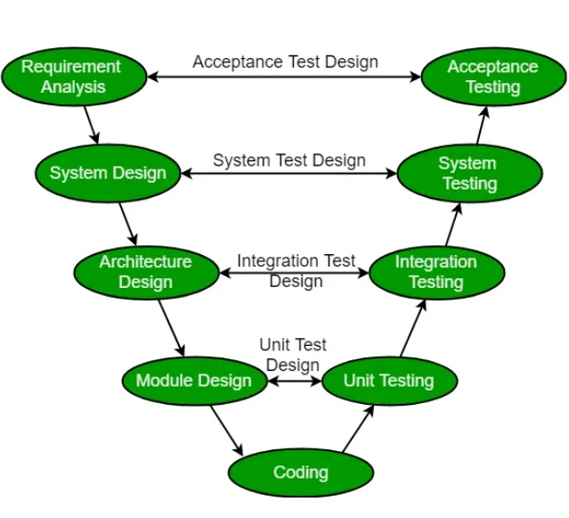

# V-Model (Verification and Validation Model)

## Table of Contents
1. [Introduction](#introduction)
2. [Overview](#overview)
3. [Phases of V-Model](#phases-of-v-model)
4. [Key Characteristics](#key-characteristics)
5. [Advantages](#advantages)
6. [Disadvantages](#disadvantages)
7. [V-Model vs Waterfall](#v-model-vs-waterfall)
8. [When to Use V-Model](#when-to-use-v-model)
9. [Practical Example](#practical-example)

---

## Introduction

The **V-Model** is a software development methodology that emphasizes verification and validation throughout the development lifecycle. It's an extension of the Waterfall model that provides a more structured approach to quality assurance by testing at every stage of development.

---

## Overview

### Core Concept
Each development phase has a corresponding testing phase, ensuring that quality is built in from the beginning rather than added at the end.
+
---

## Phases of V-Model

### Left Side (Development/Verification)

#### 1. **Requirements Analysis**
- Gather and document all functional and non-functional requirements
- Create requirement specifications document
- Identify acceptance criteria
- **Associated Test Phase**: Acceptance Testing

#### 2. **System Design**
- High-level system architecture and design
- Define system components and interactions
- Create design specifications
- **Associated Test Phase**: System Testing

#### 3. **Detailed Design**
- Low-level design for individual modules
- Design database schemas, APIs, and interfaces
- Create detailed technical specifications
- **Associated Test Phase**: Integration Testing

#### 4. **Implementation (Coding)**
- Write code based on design specifications
- Follow coding standards and guidelines
- **Associated Test Phase**: Unit Testing

### Right Side (Testing/Validation)

#### 1. **Unit Testing**
- Test individual modules/components in isolation
- Verify functions work as designed
- Test edge cases and error handling
- Corresponds to: Implementation phase

#### 2. **Integration Testing**
- Test interactions between modules
- Verify data flow between components
- Test interfaces and communication
- Corresponds to: Detailed Design phase

#### 3. **System Testing**
- Test complete integrated system
- Verify all functionality works together
- Performance and load testing
- Corresponds to: System Design phase

#### 4. **Acceptance Testing (UAT)**
- User acceptance testing
- Verify system meets business requirements
- Real-world scenario testing
- Corresponds to: Requirements Analysis phase

---

## Key Characteristics

| Characteristic | Details |
|---|---|
| **Structure** | Highly structured with clear phases |
| **Documentation** | Extensive documentation at each phase |
| **Testing** | Early and continuous testing |
| **Quality Focus** | Quality built in, not added later |
| **Risk Management** | Risks identified early |
| **Change Management** | Changes are costly once past design phase |
| **Timeline** | Sequential phases with fixed timeline |

---

## Advantages

✅ **Early Defect Detection**
- Problems found early when they're cheaper to fix

✅ **Quality Assurance**
- Systematic testing at every level
- Reduces defects in production

✅ **Clear Documentation**
- Comprehensive documentation aids maintenance
- Knowledge transfer is easier

✅ **Well-Defined Requirements**
- Requirements frozen early
- Clear understanding of project scope

✅ **Suitable for Compliance**
- Works well for regulated industries
- Good audit trail and documentation

✅ **Predictable Cost and Schedule**
- Clear phases allow accurate estimation
- Timeline is relatively fixed

✅ **Resource Planning**
- Skills needed for each phase are clear
- Easier resource allocation

---

## Disadvantages

❌ **Inflexible**
- Difficult to accommodate changes
- Requirements must be clear upfront

❌ **Not Suitable for Unclear Requirements**
- If requirements aren't well-defined, project can fail
- Late feedback can be problematic

❌ **Limited Customer Involvement**
- Customers see product only at testing phase
- Limited feedback during development

❌ **Assumes No Changes**
- Real-world projects often need requirement changes
- Change management can be expensive

❌ **Long Development Cycle**
- Takes longer to deliver initial product
- Market can change during development

❌ **High Documentation Overhead**
- Significant time spent on documentation
- Can be burden if requirements change

❌ **Late Integration**
- Integration happens late in development
- Integration issues may surface too late

---

## V-Model vs Waterfall

| Aspect | V-Model | Waterfall |
|---|---|---|
| **Testing** | Continuous at each phase | Only at the end |
| **Defect Detection** | Early | Late |
| **Documentation** | Structured and extensive | Standard |
| **Flexibility** | Low | Low |
| **Quality Focus** | High (built-in) | Standard |
| **Risk** | Lower (early detection) | Higher (late detection) |
| **Cost of Changes** | High | Very High |
| **Customer Involvement** | Limited | Limited |

---

## When to Use V-Model

✅ **Best For:**
- Projects with well-defined requirements
- Regulated industries (healthcare, finance, aerospace)
- Projects where quality is critical
- Fixed-budget and fixed-timeline projects
- Projects with experienced teams
- Safety-critical systems

❌ **Not Suitable For:**
- Agile/rapid development environments
- Projects with unclear requirements
- Startups and innovative projects
- Projects needing frequent customer feedback
- Quick time-to-market requirements

---

## Practical Example

### E-Commerce Platform Development

#### Requirements Phase
- Define payment gateway requirements
- Define user authentication requirements
- Define inventory management requirements

#### Design Phase
- Design database schema
- Design API architecture
- Design UI mockups

#### Implementation Phase
- Developers write code
- Follow design specifications

#### Unit Testing Phase
- Test payment module
- Test authentication module
- Test inventory module

#### Integration Testing Phase
- Test payment + inventory integration
- Test authentication + user profile integration

#### System Testing Phase
- Test complete e-commerce workflow
- Test payment processing end-to-end
- Test performance under load

#### Acceptance Testing Phase
- Business team verifies requirements met
- Users test real workflows
- Sign-off from stakeholders

---

## Summary

The V-Model is a disciplined approach to software development that emphasizes verification and validation at each stage. It's particularly valuable in environments where:
- Quality is paramount
- Requirements are well-defined
- Regulations require strict documentation
- The cost of defects is high

However, it requires careful planning, clear requirements, and is not well-suited for projects that need to adapt quickly to changing requirements or market conditions.

